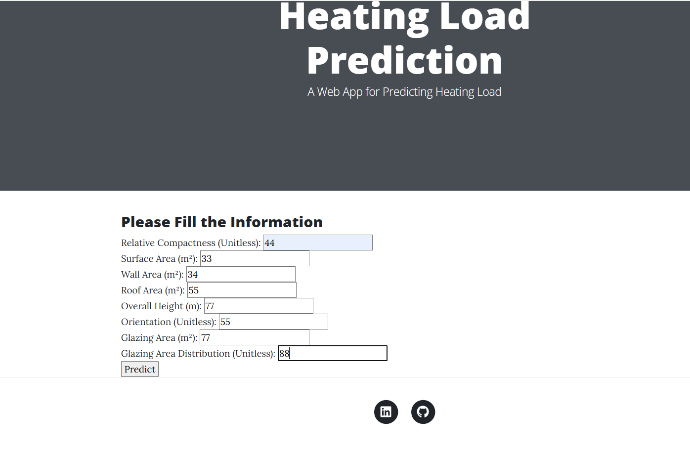

# Energy Efficiency Prediction with MLflow 🌍

## 📸 Project UI Screenshot



## 🔍 Project Overview

This project leverages machine learning to predict the **Heating Load** of a building based on various building characteristics. The goal is to help in understanding how building features such as **Surface Area**, **Wall Area**, and others influence the energy required for heating, ultimately contributing to energy efficiency predictions.


### 📊 Features Used for Prediction
- **X1 Relative Compactness**: The compactness of the building's design.
- **X2 Surface Area**: The total surface area of the building.
- **X3 Wall Area**: The area of the building's walls.
- **X4 Roof Area**: The area of the building's roof.
- **X5 Overall Height**: The height of the building.
- **X6 Orientation**: The orientation of the building (e.g., north, south).
- **X7 Glazing Area**: The area of windows in the building.
- **X8 Glazing Area Distribution**: The distribution of the glazing (windows) across the building's surfaces.


## 🛠️ How to Run the Project
### STEP 1: Clone the Repository

Clone the repository

```bash
https://github.com/vishnu-kg/Energy-Efficiency-WithMLflow
```
### STEP 02- Create a conda environment after opening the repository

```bash
conda create -n mlproj python=3.8 -y
```

```bash
conda activate mlproj
```


### STEP 03- install the requirements
```bash
pip install -r requirements.txt
```


```bash
# Finally run the following command
python app.py
```

Now,
```bash
open up you local host and port
```


## MLflow

[Documentation](https://mlflow.org/docs/latest/index.html)


##### cmd
- mlflow ui

### dagshub
[dagshub](https://dagshub.com/)

import dagshub
dagshub.init(repo_owner='  ', repo_name='Energy-Efficiency-WithMLflow', mlflow=True)


python script.py -->

Run this to export as env variables:

```bash

export MLFLOW_TRACKING_URI=https://dagshub.com/vishnukg836/Energy-Efficiency-WithMLflow.mlflow

export MLFLOW_TRACKING_USERNAME=################

export MLFLOW_TRACKING_PASSWORD=#################

```


# AWS-CICD-Deployment-with-Github-Actions

## 1. Login to AWS console.

## 2. Create IAM user for deployment

	#with specific access

	1. EC2 access : It is virtual machine

	2. ECR: Elastic Container registry to save your docker image in aws


	#Description: About the deployment

	1. Build docker image of the source code

	2. Push your docker image to ECR

	3. Launch Your EC2 

	4. Pull Your image from ECR in EC2

	5. Lauch your docker image in EC2

	#Policy:

	1. AmazonEC2ContainerRegistryFullAccess

	2. AmazonEC2FullAccess

	
## 3. Create ECR repo to store/save docker image
    - Save the URI: ############################

	
## 4. Create EC2 machine (Ubuntu) 

## 5. Open EC2 and Install docker in EC2 Machine:
	
	
	#optinal

	sudo apt-get update -y

	sudo apt-get upgrade
	
	#required

	curl -fsSL https://get.docker.com -o get-docker.sh

	sudo sh get-docker.sh

	sudo usermod -aG docker ubuntu

	newgrp docker
	
# 6. Configure EC2 as self-hosted runner:
    setting>actions>runner>new self hosted runner> choose os> then run command one by one


# 7. Setup github secrets:

    AWS_ACCESS_KEY_ID=

    AWS_SECRET_ACCESS_KEY=

    AWS_REGION = us-east-1

    AWS_ECR_LOGIN_URI = demo>>  

    ECR_REPOSITORY_NAME = simple-app


## About MLflow 
MLflow

 - Its Production Grade
 - Trace all of your expriements
 - Logging & tagging your model


